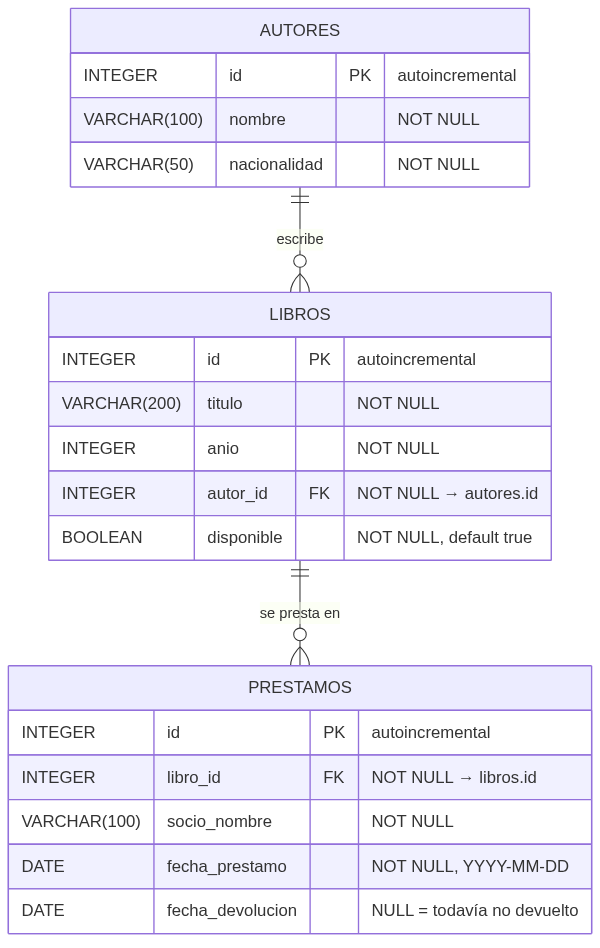
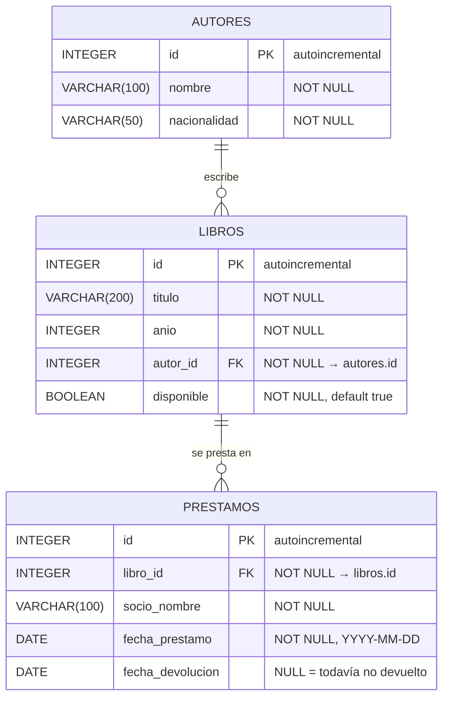

# Diagrama Entidad-Relación · Biblioteca

Este es el DER de la base de datos que ya viene armada en `biblioteca.sqlite`. Cada entidad es una tabla, y cada tabla es un modelo en `src/models/`.

El mismo diagrama en Mermaid, para editarlo si agregan tablas (se renderiza solo en GitHub y en la preview de VS Code):

## Cómo leerlo

**Relaciones**

| Relación | Cardinalidad | En palabras | En Sequelize (`models/index.ts`) |
|---|---|---|---|
| autores → libros | 1 a N | Un autor escribe muchos libros. Un libro tiene exactamente un autor. | `Autor.hasMany(Libro)` · `Libro.belongsTo(Autor)` |
| libros → prestamos | 1 a N | Un libro se presta muchas veces a lo largo del tiempo. Un préstamo es de un solo libro. | `Libro.hasMany(Prestamo)` · `Prestamo.belongsTo(Libro)` |

La notación de las patas de gallo: `||` es "exactamente uno", `o{` es "cero o muchos". Así, `AUTORES ||--o{ LIBROS` se lee: un autor tiene cero o muchos libros, y cada libro pertenece a exactamente un autor.

**Claves**

- `PK` es la clave primaria. En las tres tablas es `id`, entero autoincremental.
- `FK` es una clave foránea: una columna que guarda el `id` de una fila de otra tabla. `libros.autor_id` apunta a `autores.id`, y `prestamos.libro_id` apunta a `libros.id`.

**Una decisión de diseño para discutir**

`libros.disponible` es un dato **derivado**: en teoría se podría calcular preguntando si el libro tiene algún préstamo con `fecha_devolucion` en `NULL`. Se guarda igual como columna para que `GET /libros?disponible=true` sea una consulta simple. El costo es que la API tiene que mantenerlo sincronizado: cuando se crea un préstamo, el libro pasa a `false`; cuando se registra la devolución, vuelve a `true`. Esa es la regla de negocio del ejercicio 11.

## Cómo se traduce a las otras dos vistas

| DER | Sequelize (`models/`) | OpenAPI (`docs/openapi.yaml`) | TypeScript (`types/`) |
|---|---|---|---|
| Entidad `LIBROS` | `class Libro extends Model` | `components.schemas.Libro` | `interface Libro` |
| `titulo VARCHAR(200) NOT NULL` | `titulo: { type: DataTypes.STRING(200), allowNull: false }` | `titulo: { type: string, maxLength: 200 }` + en `required` | `titulo: string` |
| `fecha_devolucion DATE NULL` | `allowNull: true` | `nullable: true` | `fecha_devolucion: string \| null` |
| `autor_id FK` | `Libro.belongsTo(Autor, { foreignKey: "autor_id" })` | `autor_id: { type: integer }` | `autor_id: number` |

Son cuatro formas de escribir la misma forma de datos. Si cambiás una, tenés que cambiar las otras tres.
