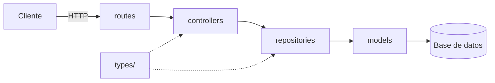
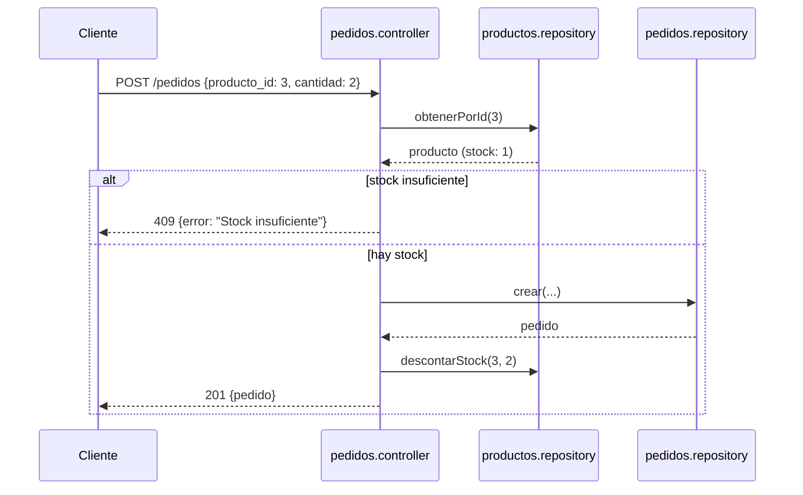

# Módulo 5 · Arquitectura y MVC

**En este archivo**

- 5.1 ¿Qué es la arquitectura de software?
- 5.2 MVC: Modelo – Vista – Controlador
- 5.3 Cómo fluye un pedido en MVC
- 5.4 Estructura de carpetas
- 5.5 El código, capa por capa
- 5.6 Una capa más cuando crece: servicios
- 5.7 Cómo dibujar un diagrama de arquitectura
- 5.8 ORM: hablar con la base sin escribir SQL
- 5.9 La capa de repositorios
- 5.10 DTOs: lo que entra y sale de la API

---

## 5.1 · ¿Qué es la arquitectura de software?

La **arquitectura** es la decisión de **cómo se organizan las partes** de un programa: qué archivos hay, qué hace cada uno, y quién puede hablar con quién.

Una API de 150 líneas en un solo archivo funciona. Pero tiene un problema que no se ve hasta que crece: **todo está mezclado**. En una misma función tenés:

1. Cómo se lee el pedido HTTP (`req.params`, `req.body`)
2. Reglas del negocio (¿se puede cancelar un pedido ya enviado?)
3. Acceso a datos (`productos.find(...)`, mañana `SELECT ...`)
4. Cómo se responde (`res.status().json()`)

Cuando todo está mezclado, cualquier cambio en una cosa te obliga a tocar las demás. Cambiar de base de datos te hace reescribir cada handler. Agregar una regla te hace buscar en qué handler va. Ese es el **código espagueti**.

La arquitectura resuelve esto con un principio: **separación de responsabilidades**. Cada parte hace **una** cosa, y sabés dónde buscar cada cosa.

## 5.2 · MVC: Modelo – Vista – Controlador

**MVC** es un patrón de arquitectura muy usado. Divide la aplicación en tres capas:

| Capa | Responsabilidad | En una API |
|---|---|---|
| **Modelo** (Model) | Los datos y cómo se accede a ellos | Las tablas y las funciones que las consultan |
| **Vista** (View) | Cómo se muestra el resultado | El JSON de la respuesta (en una API no hay HTML; la "vista" es el formato de salida) |
| **Controlador** (Controller) | Recibe el pedido, coordina, decide qué responder | Lee `req`, llama a los datos, aplica reglas, arma `res` |

Y una pieza más que en Express es fundamental:

| **Rutas** (Routes) | Mapean `verbo + URL` → controlador | `router.get("/:id", controller.obtenerUno)` |
|---|---|---|

En una API con ORM, la capa "Modelo" se suele partir en dos: los **modelos** propiamente dichos (la definición de cada tabla) y los **repositorios** (las funciones que los consultan). Ver 5.8 y 5.9.

## 5.3 · Cómo fluye un pedido en MVC

```
Cliente
  │  GET /productos/3
  ▼
┌──────────────────────────┐
│  routes                  │  "GET /:id → controller.obtenerUno"
└──────────┬───────────────┘
           ▼
┌──────────────────────────┐
│  controllers             │  lee req.params.id y lo convierte a número
│                          │  llama al repositorio
│                          │  si no hay producto → 404
│                          │  si hay → 200 + json
└──────────┬───────────────┘
           ▼
┌──────────────────────────┐
│  repositories            │  Producto.findByPk(3) → objeto plano o null
└──────────┬───────────────┘
           ▼
┌──────────────────────────┐
│  models (ORM)            │  SELECT * FROM productos WHERE id = 3
└──────────┬───────────────┘
           ▼
     Base de datos
```

**Regla de dependencias:** cada capa solo habla con la de abajo. Las rutas conocen los controladores; los controladores conocen los repositorios; los repositorios conocen los modelos. **Nunca al revés**, y nunca saltando capas: un controlador no importa un modelo, una ruta no llama a un repositorio.

Esa regla es lo que hace que un cambio quede contenido. Si cambia la base de datos, cambian modelos y repositorios; los controladores ni se enteran. Si cambia una URL, cambia una ruta; nada más.

## 5.4 · Estructura de carpetas

```
mi-api/
├── package.json
├── tsconfig.json
├── docs/
│   └── openapi.yaml               ← el contrato
└── src/
    ├── server.ts                  ← arranca Express, monta los routers
    ├── db/
    │   └── connection.ts          ← conexión a la base
    ├── types/
    │   ├── producto.ts            ← interfaces y tipos derivados del dominio
    │   ├── categoria.ts
    │   └── pedido.ts
    ├── models/
    │   ├── Producto.ts            ← definición de cada tabla para el ORM
    │   ├── Categoria.ts
    │   ├── Pedido.ts
    │   └── index.ts               ← relaciones entre modelos
    ├── repositories/
    │   ├── productos.repository.ts   ← consultas: obtenerTodos, obtenerPorId, crear...
    │   ├── categorias.repository.ts
    │   └── pedidos.repository.ts
    ├── controllers/
    │   ├── productos.controller.ts   ← HTTP: lee req, valida, llama repos, responde
    │   ├── categorias.controller.ts
    │   └── pedidos.controller.ts
    └── routes/
        ├── productos.routes.ts       ← verbo + ruta → controlador
        ├── categorias.routes.ts
        └── pedidos.routes.ts
```

**Un archivo por recurso por capa.** Cuando agregás un recurso nuevo, agregás un archivo en cada carpeta, todos con la misma forma. Cuando buscás "dónde se valida el body de pedidos", sabés que es `pedidos.controller.ts` sin abrir nada.

La carpeta `types/` no es una capa del flujo: es la que **comparten todas**. El repositorio devuelve `Producto`, el controlador recibe `Producto`, el contrato documenta `Producto`. Por eso está aparte.

## 5.5 · El código, capa por capa

La forma de cada capa, con un recurso genérico. Lo que importa es **qué hace y qué no hace** cada una, no el código exacto.

**`types/`** — la forma de los datos. Lo importan todas las capas. No tiene lógica.

```ts
export interface Categoria {
  id: number;
  nombre: string;
}

export type NuevaCategoria = Omit<Categoria, "id">;
export type EditarCategoria = Partial<NuevaCategoria>;
```

**`repositories/`** — solo datos. Es el **único** lugar que importa de `models/`. No sabe qué es `req` ni `res`. Recibe y devuelve tipos de `types/`, nunca instancias del ORM.

```ts
import { Categoria as CategoriaModel } from "../models/index.js";
import { Categoria, NuevaCategoria } from "../types/categoria.js";

export async function obtenerPorId(id: number): Promise<Categoria | null> {
  const fila = await CategoriaModel.findByPk(id);
  return fila ? fila.toJSON() : null;
}

export async function crear(datos: NuevaCategoria): Promise<Categoria> {
  const fila = await CategoriaModel.create(datos);
  return fila.toJSON();
}
```

Fijate el `toJSON()`: el repositorio traduce la instancia de Sequelize a un objeto plano que cumple la interface. Hacia arriba nadie sabe que existe Sequelize.

**`controllers/`** — HTTP. Conoce `req` y `res`, no conoce SQL ni el ORM. Convierte lo que llega (strings, `any`) a los tipos del dominio, llama al repositorio, decide el status.

```ts
import { Request, Response } from "express";
import * as Categorias from "../repositories/categorias.repository.js";

export async function obtenerUna(req: Request, res: Response) {
  const id = Number(req.params.id);
  const categoria = await Categorias.obtenerPorId(id);
  if (!categoria) return res.status(404).json({ error: "Categoría no encontrada" });
  res.json(categoria);
}
```

La conversión de `req.params.id` a número y la decisión de que "no existe" es un 404 son responsabilidad del controlador. El repositorio solo dijo `null`.

**`routes/`** — solo el mapa. Sin lógica.

```ts
import { Router } from "express";
import * as controller from "../controllers/categorias.controller.js";

const router = Router();
router.get("/:id", controller.obtenerUna);
router.post("/", controller.crear);
export default router;
```

**`server.ts`** — arma todo.

```ts
app.use("/categorias", categoriasRoutes);
app.use("/productos", productosRoutes);
```

**Cómo saber si algo está en la capa equivocada.** Preguntate qué tendría que cambiar para que ese código cambie:

- Si cambia porque cambió la base de datos → es del repositorio.
- Si cambia porque cambió un status code o el nombre de un campo del JSON → es del controlador.
- Si cambia porque cambió una URL → es de las rutas.
- Si cambia por dos motivos distintos → está mezclando capas.

## 5.6 · Una capa más cuando crece: servicios

Cuando la lógica de negocio se complica (por ejemplo, confirmar un pedido implica: verificar que el producto existe, verificar que hay stock, crear el pedido, descontar el stock, quizás avisar por email), el controlador se llena de reglas y empieza a llamar a varios repositorios. Ahí se agrega una capa **`services/`** entre controlador y repositorios:

```
routes → controllers → services → repositories → models → DB
```

El controlador queda solo con HTTP; el servicio tiene las reglas y coordina repositorios; el repositorio tiene los datos. Con dos o tres reglas en un controlador todavía no hace falta. Cuando el controlador tiene más lógica de negocio que lógica HTTP, es hora.

## 5.7 · Cómo dibujar un diagrama de arquitectura

No hace falta ninguna herramienta especial. Dos diagramas te alcanzan para explicar casi cualquier sistema:

**1. Diagrama de componentes** — *qué partes hay y quién habla con quién*. Cajas para cada componente, flechas para las dependencias.



**2. Diagrama de secuencia** — *qué pasa, en orden, para un caso concreto*. Una columna por participante, flechas horizontales en orden temporal.



Estos bloques en formato **Mermaid** se renderizan como diagramas en GitHub, Notion, VS Code (con extensión) y en mermaid.live. También podés dibujar lo mismo a mano o en Excalidraw / draw.io: lo que importa es que se entienda.

**Consejos para un buen diagrama:**
- Una idea por diagrama. No mezcles componentes con secuencia.
- Flechas con dirección: quién llama a quién.
- Nombres reales de tus archivos/funciones, no genéricos.
- Si necesitás más de 10 cajas, probablemente sean dos diagramas.
- En el de secuencia, incluí siempre al menos un camino de error. Es donde se ven las decisiones.

## 5.8 · ORM: hablar con la base sin escribir SQL

Un **ORM** (*Object-Relational Mapping*) es una librería que traduce entre objetos de tu lenguaje y filas de la base de datos. En vez de escribir `SELECT * FROM productos WHERE id = 3` y parsear el resultado, escribís `Producto.findByPk(3)` y recibís un objeto.

**Sequelize** es el ORM más usado en Node. Sus conceptos:

| Concepto | Qué es | Analogía SQL |
|---|---|---|
| **Modelo** | Una clase que representa una tabla. Define columnas y tipos. | `CREATE TABLE` |
| **Instancia** | Un objeto de esa clase. Representa una fila. | Una fila |
| **Relación** | `hasMany`, `belongsTo`: cómo se conectan dos modelos. | Clave foránea |
| **`sync()`** | Crea las tablas a partir de los modelos. | Ejecutar los `CREATE TABLE` |

Las operaciones que cubren casi todo:

| Sequelize | SQL equivalente | Devuelve |
|---|---|---|
| `Modelo.findAll({ where })` | `SELECT ... WHERE ...` | array de instancias |
| `Modelo.findByPk(id)` | `SELECT ... WHERE id = ?` | instancia o `null` |
| `Modelo.findAndCountAll({ where, limit, offset, order })` | `SELECT ... LIMIT ? OFFSET ?` + `SELECT COUNT(*)` | `{ rows, count }` |
| `Modelo.count({ where })` | `SELECT COUNT(*) ...` | número |
| `Modelo.create(datos)` | `INSERT` | la instancia creada, con `id` |
| `instancia.update(cambios)` | `UPDATE ... WHERE id = ?` | la instancia actualizada |
| `instancia.destroy()` | `DELETE ... WHERE id = ?` | — |
| `findAll({ include: { model, as } })` | `JOIN` | instancias con la relación adentro |

El `where` es un objeto: `{ categoria_id: 2, activo: true }` es `WHERE categoria_id = 2 AND activo = 1`. Para condiciones que no son igualdad se usan **operadores**: `{ nombre: { [Op.like]: "%tecl%" } }` es `WHERE nombre LIKE '%tecl%'`; `{ precio: { [Op.lte]: 20000 } }` es `precio <= 20000`.

**Instancias contra objetos planos.** Una instancia de Sequelize tiene los campos como propiedades, pero también tiene métodos, metadatos y una referencia a la conexión. No es un `Producto` de tu interface: es algo más grande. `instancia.toJSON()` devuelve el objeto plano con solo los datos. Por eso el repositorio siempre devuelve `toJSON()`: lo que sale del repositorio es un `Producto`, nada más.

**Lo que el ORM no hace por vos:** decidir qué es un 404, validar el body, aplicar reglas de negocio. Eso sigue siendo tuyo.

## 5.9 · La capa de repositorios

Un **repositorio** es un módulo con las funciones de acceso a datos de **un** recurso. Es la única capa que conoce el ORM. Hacia arriba expone funciones con nombres del dominio y tipos del dominio.

```ts
// Lo que el resto de la aplicación ve de productos.repository.ts:
obtenerTodos(filtros, paginacion): Promise<PaginaDe<Producto>>
obtenerPorId(id: number): Promise<Producto | null>
crear(datos: NuevoProducto): Promise<Producto>
actualizar(id: number, cambios: EditarProducto): Promise<Producto | null>
eliminar(id: number): Promise<boolean>
contarPorCategoria(categoriaId: number): Promise<number>
```

Nada de eso menciona Sequelize, `findByPk`, `where` ni `toJSON`. Son detalles de adentro.

**Por qué vale la pena una capa más:**

- **Los controladores quedan sin ORM.** Un controlador que hace `Producto.findAll({ where: {...}, include: ... })` mezcló HTTP con acceso a datos. Con repositorio, hace `Productos.obtenerTodos(filtros)` y listo.
- **Cambiar de ORM o de base cambia un solo archivo por recurso.** Pasar de Sequelize a otro, de SQLite a Postgres, o de una base a una API externa: los controladores no se tocan.
- **Las funciones tienen nombres del negocio.** `contarPorCategoria(2)` dice más que `count({ where: { categoria_id: 2 } })`.
- **Se puede reemplazar por uno falso** para probar controladores sin base de datos. Eso es lo que el módulo 6 llama inversión de dependencias.

**Reglas del repositorio:**

1. Recibe tipos del dominio (`number`, `NuevoProducto`), no `req`.
2. Devuelve tipos del dominio (`Producto | null`), no instancias ni `res`.
3. No decide status codes. Devuelve `null` o `false` o un número; el controlador decide qué significa.
4. No valida el body. Eso ya lo hizo el controlador en la frontera.
5. Una función por operación, con nombre de verbo: `obtener`, `buscar`, `crear`, `actualizar`, `eliminar`, `contar`.

## 5.10 · DTOs: lo que entra y sale de la API

Un **DTO** (*Data Transfer Object*, "objeto para transferir datos") es un objeto que tiene **solo los datos que viajan** entre el cliente y la API. No tiene lógica, no tiene métodos: es la forma exacta del JSON que entra o que sale.

Hay que distinguir dos cosas que se parecen mucho:

| | Entidad | DTO |
|---|---|---|
| Qué es | Una fila de la base, tal como está guardada. | Lo que la API recibe o devuelve. |
| Dónde se define | En `models/` (Sequelize) | En `types/` |
| La decide | El diseño de la base de datos | El contrato (`openapi.yaml`) |
| Quién la ve | Solo el repositorio | El cliente |

Muchas veces las dos tienen los mismos campos. Pero **son dos cosas distintas**, y cuando no coinciden, lo que se manda al cliente es el DTO.

### Un ejemplo: usuarios de la tienda

La tabla `usuarios` guarda esto:

```ts
// models/Usuario.ts → la ENTIDAD (cómo está en la base)
id             INTEGER
email          VARCHAR
password_hash  VARCHAR     ← la contraseña encriptada
rol            VARCHAR     ← "cliente" o "admin"
intentos_login INTEGER     ← dato interno para bloquear la cuenta
creado_en      TIMESTAMP
```

Pero el contrato dice que `GET /usuarios/{id}` devuelve solo esto:

```ts
// types/usuario.ts → los DTOs (lo que viaja)
export interface UsuarioRespuesta {   // DTO de salida
  id: number;
  email: string;
}

export interface NuevoUsuario {       // DTO de entrada (body del POST)
  email: string;
  password: string;
}
```

Y en algún lugar se **convierte** una cosa en la otra, con una función que elige campo por campo:

```ts
function aUsuarioRespuesta(usuario: UsuarioEntidad): UsuarioRespuesta {
  return {
    id: usuario.id,
    email: usuario.email,
  };
}
```

A esta función se la suele llamar **mapper** ("traductor"). Fijate que no copia todo con `...usuario`: nombra uno por uno los campos que salen. Así, si mañana alguien agrega una columna a la tabla, **no se filtra sola** a la respuesta.

### Por qué no se devuelve la entidad directamente

Sería más corto hacer `res.json(await Usuario.findByPk(id))`. Estos son los problemas:

**1. Se escapan datos que no deberían salir.** El cliente recibiría `password_hash`, `rol` e `intentos_login`. Aunque la contraseña esté encriptada, mandarla es darle a un atacante algo con qué trabajar. Y cualquier columna nueva que se agregue a la tabla (un DNI, una dirección, una nota interna) empieza a salir en la API **sin que nadie lo decida**.

**2. La base y la API quedan pegadas.** Si renombrás la columna `email` a `correo` en la base, la respuesta cambia y se rompen todas las apps que usan la API. Con un DTO, cambiás una línea en el mapper (`email: usuario.correo`) y el cliente no se entera. La base se puede reorganizar; el contrato se mantiene.

**3. Una instancia del ORM no es un objeto común.** Lo que devuelve Sequelize trae métodos, metadatos y una referencia a la conexión (ver 5.8). Al convertirla en JSON pueden aparecer campos que no esperabas, o relaciones enteras que se cargaron con `include`.

**4. En la entrada, el cliente puede tocar lo que no debe.** Es el mismo problema, pero al revés. Si hacés `Usuario.create(req.body)`, un cliente puede mandar:

```json
{ "email": "yo@mail.com", "password": "1234", "rol": "admin" }
```

y se crea como administrador. Con un DTO de entrada, solo se leen los campos permitidos:

```ts
const datos: NuevoUsuario = { email: req.body.email, password: req.body.password };
// `rol` no está en NuevoUsuario → se ignora. El servicio le pone "cliente".
```

Este ataque tiene nombre: **asignación masiva** (*mass assignment*).

### Cuándo se usa

**Siempre que un dato cruza la frontera de la API**, es decir, en todo lo que entra por `req.body` y en todo lo que sale por `res.json`. En la práctica:

- **Un DTO de entrada por cada body distinto:** `NuevoProducto` (POST), `EditarProducto` (PATCH).
- **Un DTO de salida por cada forma de respuesta:** `Producto`, `PaginaDeProductos`, `UsuarioRespuesta`.

**¿Y si la entidad y el DTO tienen exactamente los mismos campos?** Pasa seguido en APIs chicas: la tabla `categorias` tiene `id` y `nombre`, y la respuesta también. En ese caso alcanza con **un solo tipo** en `types/` (`Categoria`) y con que el repositorio devuelva `toJSON()`. Ese tipo ya funciona como DTO: es un objeto plano que cumple el contrato, no una instancia del ORM. Lo que importa es la regla: **lo que sale de la API lo decide el contrato, no la tabla**. El día que la tabla tenga un campo que no debe salir, se agrega el mapper.

### Dónde va cada cosa

```
Cliente ──JSON──▶ controller ──DTO entrada──▶ service ──▶ repository ──▶ entidad (models/)
Cliente ◀──JSON── controller ◀──DTO salida─── service ◀── repository ◀── entidad (models/)
```

- Los **DTOs** se definen en `types/`, igual que en el contrato.
- El **controller** arma el DTO de entrada con los campos permitidos del `req.body`, después de validarlos.
- La **entidad** nunca sale del repositorio (regla de 5.9). El repositorio devuelve objetos planos.
- El **mapper** a DTO de salida va en el repositorio (si es simple, como `toJSON()`) o en el service (si hay que sacar campos o combinar datos). Nunca en la ruta.

**Cómo saber si te falta un DTO:** mirá el JSON que devuelve un endpoint y compará con el schema del contrato. Si hay algún campo de más, estás devolviendo la entidad.
